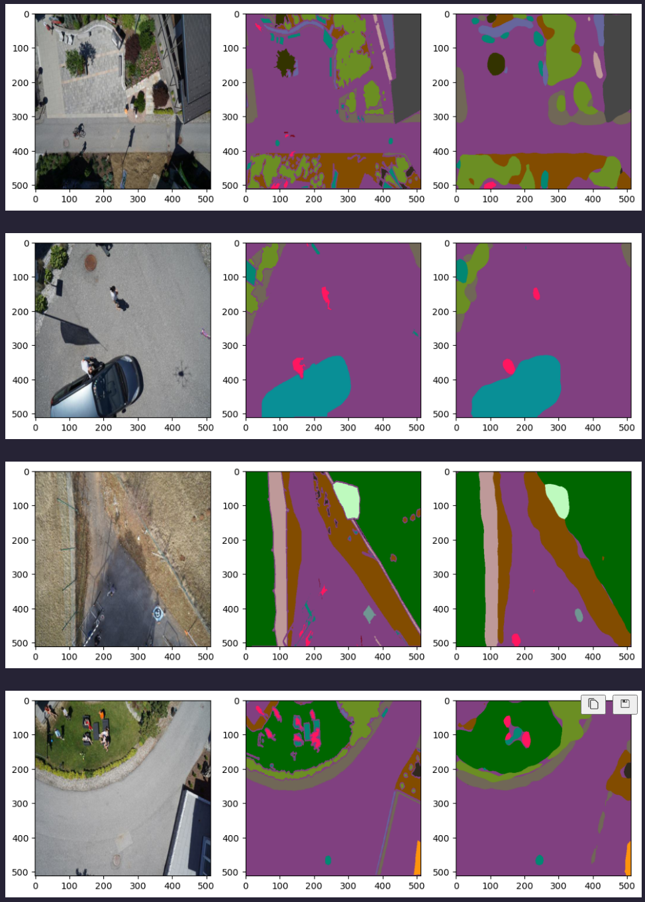

# Camvid_Semantic_Segmentatation_TF2

> The goal of this project is to illustrate how easy it is to perform image segmentation with Pytorch. With relatively little effort it is possible to achieve acceptable results. 
Here we use a DeeplabV3 model with a ResNet101 backbone. Due to the relatively complex nature of the problem (24 categories and only 500 training images) augmentation is also used. Therefore utilize the great Albumentation library (See. https://albumentations.ai/).
The code here should serve as template to help you get started with your own project.
However, in the near future, I will provide pretrained models for inference.

**I will add run instructions in the near future**

The dataset can be downloaded from kaggle:
https://www.kaggle.com/datasets/bulentsiyah/semantic-drone-dataset
